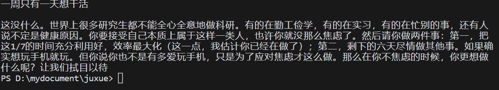

# Vector_store
向量知识库 | 相似度搜索 | 微信小程序：AI爱家

为 AI爱家聊天机器人 创建向量知识库，并选取合适方法进行相似度搜索 

To create a vector store using embedding technologies, provided by OpenAI，Word2Vec，Meta AI, BaiduPaddle, packages on huggingface. Then do vector similarity search.

# 目录
- [构建向量知识库](#构建向量知识库)
  - [OpenAI](#openai)
  - [Word2Vec](#word2vec)
  - [Faiss and Rocket QA](#Faiss-and-Rocket-QA)
  - [HuggingFace](#Huggingface)
  - [结论](#结论)
- [向量知识库搜索方法](#向量知识库搜索方法)
  - [ANN](#ANN)
  - [余弦相似度](#余弦相似度)
- [搜索结果示例](#搜索结果示例)
- [References](#References)

## 构建向量知识库

下列构建向量数据库方法基本包括：方法介绍，代码，向量数据库文件及其下载链接

### openai

OpenAI Embedding 利用基于 transformers 架构的 GPT-3 预训练模型，将单词和句子映射到一个连续的向量空间，这些向量能够捕捉到连续的文本语义信息。最后产生一个输出的向量序列作为文本的向量表示。`openai/vector_store.ipynb`借由 openai embedding 接口完成嵌入，而后利用 LLM 能力进而完成数据库搜索。嵌入的向量数据库保存在 `openai/index` 下，其中 .bin 文件保存文件字节流序列化及反序列化等，存储的是 Python 中的对象即向量数据；.pkl 文件保存模型的权重及其他相关信息即向量与原始文本之间的映射关系，包括从原始ID映射到uuid，从uuid映射回原始ID以及相关包含索引的元数据

### word2vec

Word2Vec 是一种用于生成词向量的浅层神经网络模型。其基本思想是在大量文本数据上训练模型，使得语义上相似的单词在向量空间中的位置靠近。其隐藏层没有激活函数，也没有偏置项。这使得模型可以直接将one-hot编码的输入映射到词嵌入上，然后再映射到输出上。这样，一旦模型训练完毕，我们可以直接取出隐藏层的权重，作为我们的词向量。`word2vec/create_vs.py` 通过 Word2Vec 算法来完成嵌入，生成的向量数据库保存在 `vector_store.index `  [下载链接](https://drive.google.com/file/d/1YPcl72LZw9kJgo3puVP2CyixmEz5zzws/view?usp=sharing)

### Faiss and Rocket QA

Faiss 是由 Facebook AI 开发的一款用于高效相似性搜索和密集向量聚类的库。对于构建向量知识库的情境，我们主要用到的是 Faiss 的相似性搜索功能。Rocket QA 是飞桨开源的问答系统。利用 Faiss 和 RocketQA（一个基于 Transformer 模型的开源问答系统）来实现一个搜索引擎。搜索引擎的目的是根据用户提供的问题（查询），找出最相关的答案。

  
Faiss构建索引速度更快的理论基础

  使用 Faiss 进行大规模相似性搜索通常会比传统的搜索方法更快。这主要是因为 Faiss 使用了一种称为 "近似最近邻搜索" (Approximate Nearest Neighbor Search, ANN) 的方法，这种方法可以大大减少搜索过程中的计算量。在传统的最近邻搜索 (Nearest Neighbor Search, NNS) 中，我们需要计算查询向量与数据库中每一个向量的距离，这种操作在高维度和大数据量的情况下会非常耗时。而在 Faiss 中，使用了一种叫做 "量化" (Quantization) 的方法，将原本需要大量存储和计算的向量进行了压缩，并且在压缩的过程中尽量保持原有的距离关系。这使得在 Faiss 中，我们可以在压缩后的表示上进行计算L2距离即L2范数，从而大大提升了搜索速度。另外，Faiss 还支持 GPU 加速，这对于大规模的相似性搜索任务来说是非常有用的。需要注意的是，Faiss 使用的 ANN 方法在提升搜索速度的同时，可能会对搜索结果的精度产生一定的影响。但在实际应用中，这种影响往往可以接受。

  
Rocket QA介绍

  双塔模型 (Dual Encoder) 主要用于处理大规模的候选检索阶段。在这个阶段，系统将问题和候选答案分别输入两个相同的神经网络（塔）进行编码，然后比较编码结果的相似性来筛选出最相关的候选答案。
  交叉编码器 (Cross Encoder) 在第一阶段筛选出的候选答案中进行精细的排序。它将问题和候选答案作为一个整体输入到模型中，模型会输出一个分数，表示这个答案的相关性。交叉编码器通常比双塔模型更精确，但是计算复杂度更高，所以通常在筛选过的较小的候选集中使用。

这里我们使用之前已有的 faiss 向量数据库进行查询，文本清洗及文本分段的代码见`faiss/faiss_pre.py`，从Faiss索引中依据query和Rocket QA取回查询结果的代码见`faiss/faiss_retrieval.py`

  
faiss 数据集下载链接

  链接: https://pan.baidu.com/s/1vGbwEQlGWTiy8u4LUNf_gg?pwd=pkyh 提取码: pkyh

### Huggingface

利用 huggingface 上的中文 embedding 库构建向量数据库，并进行向量相似度搜索寻找最符合的句段。
- 本机运行代码见`huggingface/text2vec.py`, CPU Ram 8GB, 对《5%的改变》这本书进行 embedding 耗时1.5h，结果保存在`knowledge_vectors_1.pkl` 共400MB，[下载链接](https://drive.google.com/file/d/1QaNpN4EKys1sippa6SDebsFseQbaN7xV/view?usp=sharing) ;
- Colab 版本为`text2vec.ipynb`且调用 GPU:Tesla T4 加速，所用数据为`huggingface/test_book`下的8本中文书籍，大概耗费6h生成32.65GB大小的`knowledge_vectors.pkl`，[下载链接](https://drive.google.com/file/d/1rh2UXEnc8vocZeVm8_pe7DphMTHRLvZN/view?usp=sharing)
- 文本清洗时使用的中文停用词见`cn_stop_words.txt`

### 结论

使用大模型的接口较自己搭建 embedding 模型效果更好，速度更快。其中 Faiss 使用 ANN 算法减少计算 L2 范数时的计算量，在数据量较大时更有用；而 OpenAI embedding 接口及之后的相似度搜索采用的是余弦相似度，在数据量较小时更适用。

## 向量知识库搜索方法

- 构建文本的向量表示：首先，你需要将每段文本转化为向量。这通常可以通过训练好的嵌入模型来实现，比如Word2Vec、GloVe或BERT等。
- 构建哈希表（可选）：然后，使用LSH或其他哈希方法，将每个文本的向量表示映射到哈希空间，并构建哈希表。若要使用需将 scikit-learn 降级至 0.16.1，推荐使用 Faiss 或 Annoy.
- 搜索最近邻：当你有一个查询向量时，你可以首先将查询向量映射到哈希空间，然后在哈希表中搜索最近的哈希值，从而找到最近邻的文本。

### ANN

- Approximate Nearest Neighbor 这种算法可以在牺牲一定精度的前提下，大大提高搜索速度。哈希（Hashing）是ANN中的一种常见方法。基于哈希的ANN通常使用局部敏感哈希（Locality Sensitive Hashing，简称LSH）或其他哈希方法，将原始的高维空间映射到一个低维的哈希空间。在哈希空间中，相似的项会有相同或者相似的哈希值。这样，我们就可以通过比较哈希值来快速找到近似最近邻。
- LSH Forest：局部敏感哈希森林是普通近似最近邻搜索方法的替代方法, LSH Forest 数据结构是使用排序数组、二分搜索和 32 位固定长度哈希来实现的。使用随机投影作为近似余弦距离的哈希族。
- Annoy: APPROXIMATE NEAREST NEIGHBORS OH YEAH，近似最近邻搜索算法是 LSH Forest 这种算法的替代方法（LSH Forest 算法已 deprecated），采用了二叉树这个数据结构来提升查询的效率，目标是把查询的耗时减少至 O(\ln(n)).
-代码示例见：`search/annoy.py`

### 余弦相似度

Cosine Similarity:

$$ \text{cosine similarity} = \frac{\mathbf{A} \cdot \mathbf{B}}{\| \mathbf{A} \| \| \mathbf{B} \|} = \frac{ \sum_{i=1}^{n} A_i B_i }{ \sqrt{\sum_{i=1}^{n} A_i^2} \sqrt{\sum_{i=1}^{n} B_i^2} } $$

如果 Latex 公式不能正常显示，请安装 mathjax plugin for github [安装链接](https://chrome.google.com/webstore/detail/mathjax-plugin-for-github/ioemnmodlmafdkllaclgeombjnmnbima)

具体实现时为了提高效率，经常采用计算向量点积后归一化的方法，这里直接给出代码示例：
- `search/cos_similarity_search.ipynb`适用于文本数量较小比如单篇文章
- `search/cos_search_2.py`适用于文本数量较大比如书籍

### 搜索结果示例

## References

1. [Embeddings - OpenAI API](https://platform.openai.com/docs/guides/embeddings/what-are-embeddings)
2. [word2vec | TensorFlow Core](https://www.tensorflow.org/tutorials/text/word2vec#:~:text=word2vec%20is%20not%20a%20singular,downstream%20natural%20language%20processing%20tasks.)
3. [搜索召回 | Facebook：亿级向量相似度检索库Faiss原理+应用](https://zhuanlan.zhihu.com/p/432317877)
4. [Faiss Documentation](https://faiss.ai/)
5. [PaddlePaddle/RocketQA](https://github.com/PaddlePaddle/RocketQA)
6. [Using Vector Stroes - LlamaIndex](https://gpt-index.readthedocs.io/en/latest/how_to/integrations/vector_stores.html)
7. [text2vec-large-chinese - Hugging Face](https://huggingface.co/GanymedeNil/text2vec-large-chinese)
8. [ANNOY](https://sds-aau.github.io/M3Port19/portfolio/ann/)
